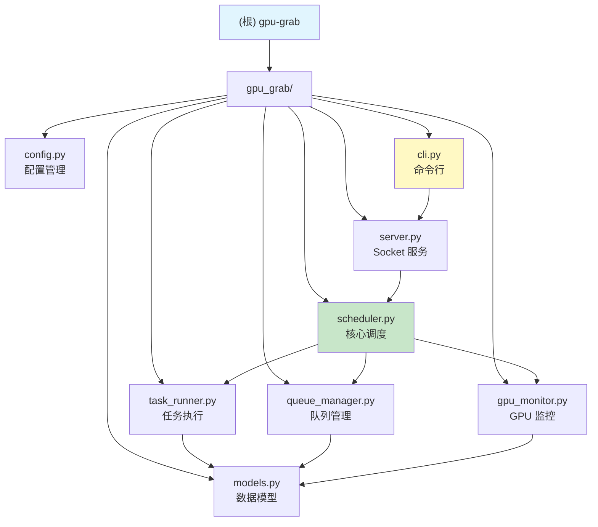

# gpu-grab

> AI 辅助开发上下文文档 | 初始化于 2025-12-09

---

## 变更记录 (Changelog)

| 日期 | 版本 | 变更内容 |
|------|------|----------|
| 2025-12-09 17:27 | v1.0.0 | 完整扫描：识别 Python GPU 任务调度器架构，8 个核心模块，完整 CLI 接口 |
| 2025-12-09 16:43 | v0.0.1 | 增量扫描确认：项目仍为空仓库，等待源代码添加 |
| 2025-12-09 16:41 | v0.0.0 | 初始化项目 AI 上下文文档（空仓库模板） |

---

## 项目愿景

**GPU Training Task Scheduler** - 一个基于 Python 的 GPU 训练任务调度系统，支持：

- 自动监控 GPU 资源状态（显存、利用率、温度）
- 智能任务队列管理与优先级调度
- 基于资源需求的自动 GPU 分配
- 命令行界面 (CLI) 进行任务提交与管理
- Unix Socket 通信实现客户端-服务端架构

---

## 架构总览

```
.gpu-grab/
  pyproject.toml         # 项目配置与依赖
  main.py                # 简单入口（开发用）
  .python-version        # Python 3.13
  gpu_grab/              # 核心包
    __init__.py          # 版本定义
    config.py            # 配置管理
    models.py            # 数据模型（Task, GPUStatus, GPURequirement）
    gpu_monitor.py       # GPU 监控（NVML 接口）
    queue_manager.py     # 任务队列持久化
    task_runner.py       # 进程执行管理
    scheduler.py         # 核心调度器
    server.py            # Unix Socket 服务端
    cli.py               # 命令行接口
```

**技术栈**:
- **语言**: Python 3.13+
- **GPU 接口**: pynvml (NVIDIA Management Library)
- **配置格式**: YAML
- **通信协议**: Unix Socket + JSON
- **构建系统**: Hatchling

**核心依赖**:
- `pynvml>=13.0.1` - NVIDIA GPU 监控
- `pyyaml>=6.0.3` - 配置文件解析

---

## 模块结构图



---

## 模块索引

| 模块路径 | 职责 | 核心类/函数 | 依赖 |
|----------|------|-------------|------|
| `gpu_grab/config.py` | 系统配置管理，YAML 加载/保存 | `Config` | pyyaml |
| `gpu_grab/models.py` | 数据模型定义 | `Task`, `TaskStatus`, `GPUStatus`, `GPURequirement` | - |
| `gpu_grab/gpu_monitor.py` | GPU 状态监控 | `GPUMonitor` | pynvml |
| `gpu_grab/queue_manager.py` | 任务队列持久化（JSON） | `QueueManager` | models |
| `gpu_grab/task_runner.py` | 子进程生命周期管理 | `TaskRunner` | models |
| `gpu_grab/scheduler.py` | 主调度循环 | `Scheduler` | config, gpu_monitor, queue_manager, task_runner |
| `gpu_grab/server.py` | Unix Socket 服务端 | `UnixSocketServer` | - |
| `gpu_grab/cli.py` | 命令行工具入口 | `main()`, `cmd_*` | - |

---

## 运行与开发

### 环境要求

- Python 3.10+（推荐 3.13）
- NVIDIA GPU + 驱动
- Linux 系统（Unix Socket 依赖）

### 快速启动

```bash
# 安装依赖
cd ~/.gpu-grab
pip install -e .

# 运行 CLI（需要先启动服务端）
gpu-grab status
gpu-grab submit "python train.py" --name my-training --gpu-count 2
gpu-grab list
gpu-grab logs <task_id>
```

### 常用命令

| 命令 | 描述 |
|------|------|
| `gpu-grab submit <cmd>` | 提交训练任务 |
| `gpu-grab status` | 查看系统状态（GPU + 队列） |
| `gpu-grab list [-s STATUS]` | 列出任务 |
| `gpu-grab cancel <id>` | 取消待处理任务 |
| `gpu-grab logs <id> [-t N]` | 查看任务日志 |

### CLI 参数详解

```bash
gpu-grab submit "python train.py" \
  -n "训练任务名"       # --name
  -w /path/to/dir      # --workdir 工作目录
  -g 0,1               # --gpus 指定 GPU
  -c 2                 # --gpu-count 所需 GPU 数量
  -m 8.0               # --memory 最小空闲显存 (GB)
  -u 20                # --util-margin 利用率余量 (%)
  -p 10                # --priority 优先级
  -e KEY=VALUE         # --env 环境变量
```

---

## 数据模型

### TaskStatus (枚举)

| 状态 | 说明 |
|------|------|
| `PENDING` | 等待调度 |
| `RUNNING` | 正在运行 |
| `COMPLETED` | 成功完成 |
| `FAILED` | 执行失败 |
| `CANCELLED` | 已取消 |

### GPURequirement

| 字段 | 类型 | 默认值 | 说明 |
|------|------|--------|------|
| `gpu_ids` | `list[int]` | None | 指定 GPU，None 表示任意 |
| `min_free_memory_gb` | `float` | 0.0 | 最小空闲显存 |
| `max_util_percent` | `float` | 100.0 | 最大利用率阈值 |
| `gpu_count` | `int` | 1 | 所需 GPU 数量 |

### Task

核心任务实体，包含命令、工作目录、环境变量、资源需求、状态、时间戳、分配的 GPU 等。

---

## 测试策略

- 当前无测试目录
- 建议添加 `tests/` 目录，使用 pytest
- 重点测试：
  - `QueueManager` 持久化逻辑
  - `GPUMonitor.check_requirements()` 资源匹配
  - `Scheduler._schedule_pending_tasks()` 调度决策

---

## 编码规范

- 使用 dataclass 定义数据模型
- 类型注解完整（Python 3.10+ 语法）
- 日志使用 `logging` 模块
- 文件锁保护并发访问（`fcntl`）

---

## AI 使用指引

### 适合 AI 协助的任务

- 添加新的 CLI 子命令
- 实现服务端守护进程启动逻辑
- 添加任务依赖/DAG 调度
- 实现 REST API 接口（替代/补充 Unix Socket）
- 编写单元测试

### 上下文提示

与 AI 协作时，建议提供：
1. 当前需要修改的模块路径
2. 期望的输入/输出行为
3. 是否需要保持向后兼容

### 当前待完善功能

1. **服务端启动命令** - `cli.py` 缺少 `gpu-grab serve` 子命令
2. **日志跟踪 (follow)** - `cmd_logs` 中 TODO 标记
3. **配置文件管理** - 缺少 `gpu-grab config` 命令
4. **任务依赖** - 当前无任务间依赖支持

---

## 覆盖率报告

| 指标 | 数值 |
|------|------|
| 估算总文件数 | 11（不含 .git/.venv/文档） |
| 已扫描文件数 | 11 |
| 覆盖率 | 100% |
| 识别模块数 | 1（gpu_grab 包） |
| 核心源文件 | 9 |

### 文件清单

| 类别 | 文件 |
|------|------|
| 配置 | `pyproject.toml`, `.python-version` |
| 入口 | `main.py`, `gpu_grab/cli.py` |
| 核心 | `config.py`, `models.py`, `gpu_monitor.py`, `queue_manager.py`, `task_runner.py`, `scheduler.py`, `server.py` |

---

## 建议下一步

1. **补充服务端入口** - 在 `cli.py` 添加 `serve` 子命令
2. **添加测试** - 创建 `tests/` 目录，覆盖核心逻辑
3. **日志轮转** - 当前配置存在但未实现
4. **系统服务** - 考虑添加 systemd 单元文件

---

_此文档由 Claude 自动生成，最后更新：2025-12-09T17:27:32+0800_
