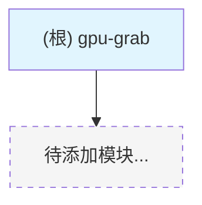

# gpu-grab

> AI 辅助开发上下文文档 | 初始化于 2025-12-09

---

## 变更记录 (Changelog)

| 日期 | 版本 | 变更内容 |
|------|------|----------|
| 2025-12-09 16:43 | v0.0.1 | 增量扫描确认：项目仍为空仓库，等待源代码添加 |
| 2025-12-09 16:41 | v0.0.0 | 初始化项目 AI 上下文文档（空仓库模板） |

---

## 项目愿景

GPU 资源获取/管理工具 - 用于监控和获取云平台或集群中的 GPU 资源。

**预期功能**（待开发确认）：
- GPU 资源可用性监控
- 自动抢占/预约 GPU 实例
- 多平台支持（云厂商、集群调度器）
- 通知与告警机制

---

## 架构总览

```
.gpu-grab/
  CLAUDE.md           # AI 上下文文档（本文件）
  .claude/
    index.json        # 扫描索引与元数据
  .git/               # Git 版本控制
  (等待添加源代码...)
```

**技术栈**: 待定

**核心功能**: 待定

---

## 模块结构图



> 注：当前为空项目，模块结构将在代码添加后自动更新。

---

## 模块索引

| 模块路径 | 职责 | 语言 | 入口文件 | 测试覆盖 |
|----------|------|------|----------|----------|
| _(暂无模块)_ | - | - | - | - |

---

## 运行与开发

### 环境要求

- 待定（根据技术栈选择确定）

### 快速启动

```bash
# 待补充 - 项目初始化后更新
```

### 常用命令

| 命令 | 描述 |
|------|------|
| _(待添加)_ | - |

---

## 测试策略

- 待定

---

## 编码规范

- 待定（建议在项目初始化时确定 linter/formatter 配置）

---

## AI 使用指引

### 适合 AI 协助的任务

- 项目初始化与脚手架搭建
- 代码生成与模板创建
- 文档编写
- 代码审查与优化建议

### 上下文提示

当与 AI 协作开发时，建议提供：
1. 项目的目标功能描述
2. 技术栈选择（语言、框架）
3. 部署环境要求
4. 目标平台（哪些云厂商/集群系统）

### 推荐技术栈选项

根据 "gpu-grab" 的用途，以下是常见技术栈建议：

| 方案 | 语言 | 适用场景 |
|------|------|----------|
| CLI 工具 | Go / Rust / Python | 命令行交互，跨平台部署 |
| 后台服务 | Go / Python + FastAPI | 长期运行，API 接口 |
| 脚本工具 | Python / Bash | 快速原型，自动化脚本 |

---

## 覆盖率报告

| 指标 | 数值 |
|------|------|
| 估算总文件数 | 0（不含 .git 和文档） |
| 已扫描文件数 | 0 |
| 覆盖率 | 100%（空仓库） |
| 识别模块数 | 0 |

---

_此文档由 Claude 自动生成，请在项目开发过程中持续更新。_
